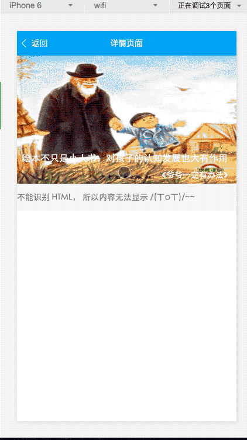

#微信小程序尝鲜demo  
* 模拟知乎日报的首页
* 跳转的文章页 html页面部分识别不了
* 感谢 myronliu347 分享的demo 自己照着敲了一遍，感谢大神
## 预览

## 使用

克隆项目 -> 在微信开发工具中添加项目 -> 选择项目目录 -> 启动

## 资源

* [官方文档](https://mp.weixin.qq.com/debug/wxadoc/dev/?t=1474644083132)
* 